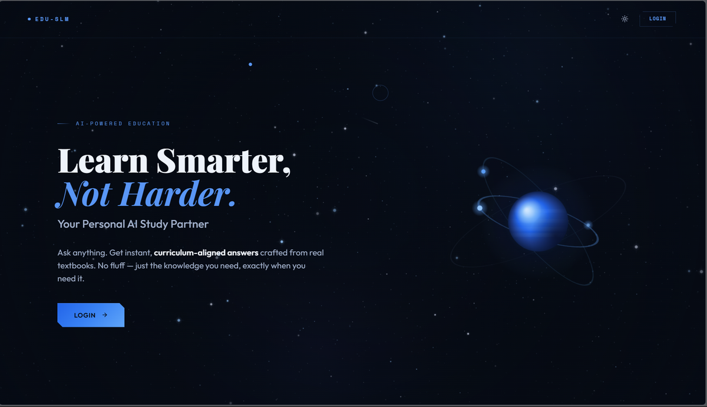
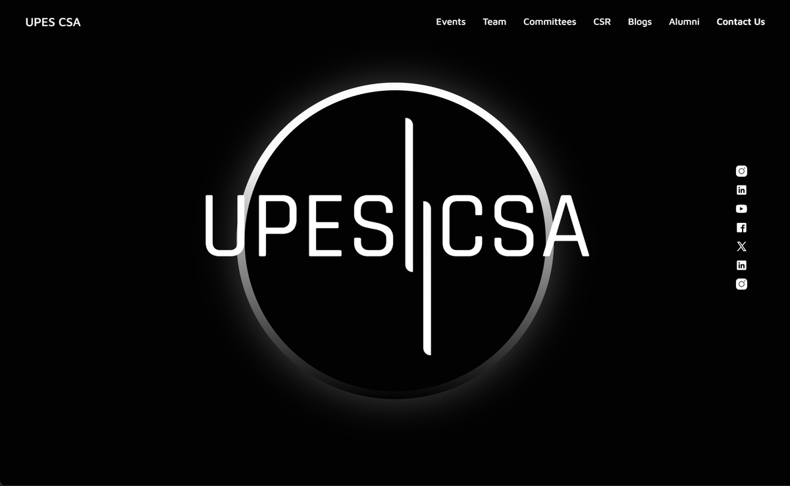
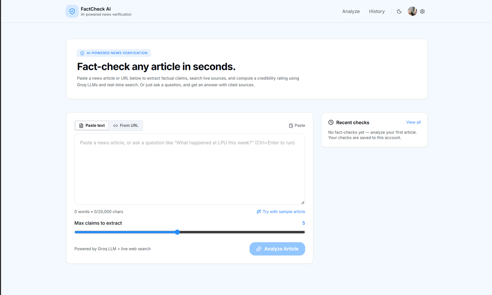
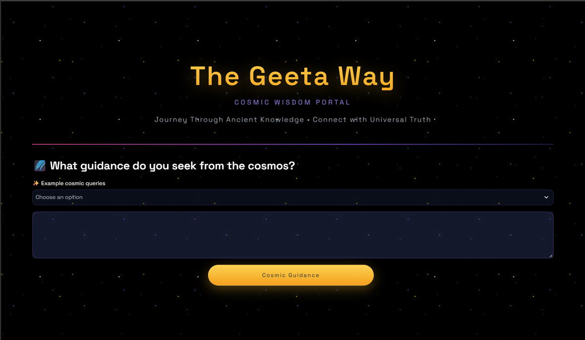

<picture>
  <source media="(prefers-color-scheme: dark)" srcset="assets/header-dark.png"/>
  <source media="(prefers-color-scheme: light)" srcset="assets/header-light.png"/>
  
</picture>

<h1 align="center">Rudra Gupta</h1>

<em>Software engineer who happens to speak fluent machine learning.</em>

B.Tech CSE (AI/ML), UPES Dehradun &nbsp;·&nbsp; CGPA 8.14/10 &nbsp;·&nbsp; 2023–2027

I take work through to something **running in production**, not a prototype — agentic systems, retrieval and fine-tuning, plus the backend and infrastructure that keeps them up. I build with AI coding assistants as standard practice, and exercise judgement on what they generate before it ships.

> *A jack of all trades is a master of none, but oftentimes better than a master of one.*

## Experience

**Bilby.ai** &nbsp;·&nbsp; Intern &nbsp;&nbsp;Remote (Hong Kong) &nbsp;·&nbsp; Jun – Jul 2026 
Reverse-engineered a SOTA agentic harness — MCP tool integration, context management, tool orchestration — and wrote the comparative research behind the team's tooling decisions.

**IIT Jammu** &nbsp;·&nbsp; Research Intern &nbsp;&nbsp;Hybrid &nbsp;·&nbsp; Jun – Jul 2026 
Built a privacy-preserving agentic pipeline that generates database algorithms without exposing raw data to the LLM. Researched knowledge conflicts in RAG and strategies for resolving them.

**Pi Craft** &nbsp;·&nbsp; Web Developer Intern &nbsp;&nbsp;Remote &nbsp;·&nbsp; Jun – Jul 2025 
Built the company site in React on reusable components, with AVIF asset optimisation for faster loads across devices.

## Selected work

<table>
<tr>
<td width="50%">
<b>Edu-SLM</b>
</td>
<td width="50%">
<b>UPESCSA.in</b>
</td>
</tr>
<tr>
<td width="50%">
<b>Agentic Fact-Checking Platform</b>
</td>
<td width="50%">
<b>TheGeetaWay</b>
</td>
</tr>
</table>

**Edu-SLM** &nbsp;—&nbsp; LoRA fine-tune of LLaMA and Qwen with RAG-assisted distillation over an Operating Systems curriculum. **95.3%** on a 655-MCQ benchmark. 
`Python` `PyTorch` `LoRA/PEFT` `RAG` `FAISS`

**[UPESCSA.in](https://upescsa.in)** &nbsp;—&nbsp; MERN event platform, live on AWS EC2. Deployment is hand-rolled: Docker provisioning, nginx reverse proxy and Let's Encrypt TLS in a single command. 
`MongoDB` `Express` `React` `Node.js` `Docker` `Nginx`

**[Agentic Fact-Checking Platform](https://agentic-fact-checker.vercel.app)** &nbsp;—&nbsp; Decomposes a news article into verifiable claims, gathers evidence by automated search, and scores credibility claim by claim. Prompts versioned in MongoDB. 
`Python` `FastAPI` `Groq` `React` `MongoDB`

**[TheGeetaWay](https://thegeetaway.streamlit.app)** &nbsp;—&nbsp; Semantic search and RAG over Bhagavad Gita verses; Llama 3 answers grounded in the verses actually retrieved. 
`Python` `FastAPI` `Streamlit` `FAISS` `Llama 3`

## Stack

## Activity

<picture>
  <source media="(prefers-color-scheme: dark)" srcset="https://raw.githubusercontent.com/byRudra/byRudra/output/snake-dark.svg"/>
  <source media="(prefers-color-scheme: light)" srcset="https://raw.githubusercontent.com/byRudra/byRudra/output/snake.svg"/>
  
</picture>

## Recognition

- **SIH 2025** — top 5 teams, Smart India Hackathon internal round
- **AWS Community Day Dehradun 2025** — cross-team technical and operational coordination, 100+ participants
- **UPES Hackathon 4.0** — led problem-statement design and evaluation for a national-level event
- Certified: [Software Engineer](https://www.hackerrank.com/certificates/77beaf00239a) and [Python](https://www.hackerrank.com/certificates/1582c0cf1cc0) (HackerRank) &nbsp;·&nbsp; [Claude Code 101](https://academy.claude.com/verify/2f3e4b938b3d34771bc8b3239bf20b68) (Anthropic Academy)

---

Open to conversations about agentic systems, retrieval, and backend engineering.

